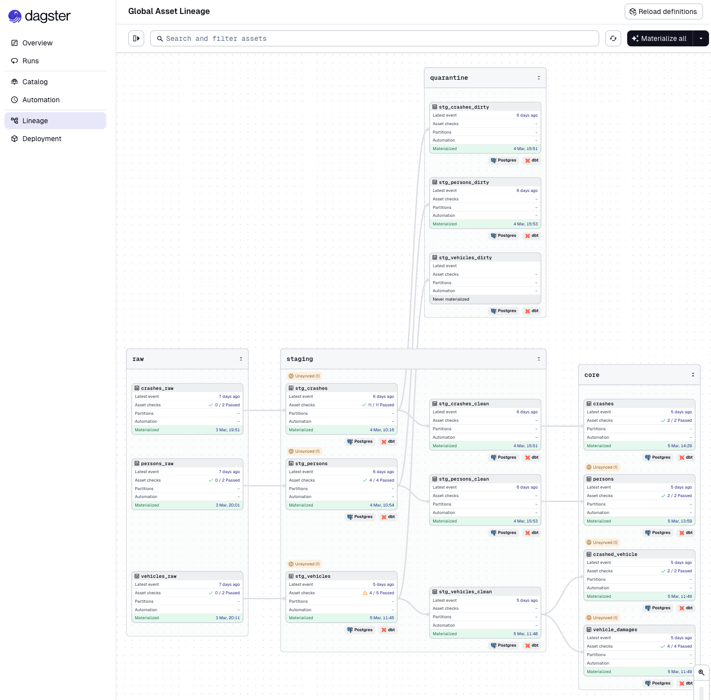

# NYC Crashes — Dagster + dbt Pipeline

An end-to-end data pipeline for the [NYC Motor Vehicle Collisions dataset](https://data.cityofnewyork.us/Public-Safety/Motor-Vehicle-Collisions-Crashes/h9gi-nx95) published by the NYC Open Data portal. Raw CSV data is ingested into PostgreSQL via Dagster asset materializations and transformed into analytics-ready tables by dbt.



---

## Tech Stack

| Tool | Version | Role |
|---|---|---|
| Python | 3.13 | Runtime |
| Dagster | 1.12.17 | Orchestration & asset lineage |
| dbt-postgres | 1.11.6 | Transformation layer |
| dbt_utils | 1.3.3 | Surrogate key generation |
| PostgreSQL | — | Storage |

---

## Project Structure

```
nyc_crashes_dagster_dbt/
├── nyc_crashes_dagster_dbt/        # Python package
│   ├── assets/
│   │   ├── crashes.py              # Raw ingestion assets (crashes, persons, vehicles)
│   │   └── dbt_assets.py          # dbt asset definition
│   ├── dbt/                        # dbt project
│   │   ├── models/
│   │   │   ├── staging/           # Type casting & string normalisation
│   │   │   ├── clean/             # Filter out null PKs & invalid values
│   │   │   ├── quarantine/        # Rows rejected by clean layer
│   │   │   ├── core/              # Surrogate-keyed analytics tables
│   │   │   └── marts/             # Star-schema fact and dimension tables
│   │   ├── macros/
│   │   ├── packages.yml
│   │   └── profiles.yml
│   ├── resources.py                # PostgresResource
│   └── definitions.py             # Dagster Definitions entry point
├── data/                           # Source CSV files (gitignored)
├── pyproject.toml
└── dagster.yaml
```

---

## Data Sources

Three CSV files from the NYC Open Data portal, loaded into the `raw` schema:

| Table | Rows | Description |
|---|---|---|
| `raw.crashes` | 2,245,591 | One row per crash event |
| `raw.persons` | 5,903,657 | One row per person involved |
| `raw.vehicles` | 4,504,354 | One row per vehicle involved |

---

## dbt Model Layers

### Staging (`staging` schema)
Reads directly from `raw`. Applies:
- `dbt.safe_cast` for all typed columns (date, time, integer, numeric, bigint)
- `nullif(trim(lower(col)), '')` on all string columns — lowercases, trims whitespace, and converts empty strings to null

| Model | Rows |
|---|---|
| `stg_crashes` | 2,245,591 |
| `stg_persons` | 5,903,657 |
| `stg_vehicles` | 4,504,354 |

### Clean (`staging` schema)
Filters the staging models to rows with valid, non-null primary keys and sensible numeric ranges. Rows that fail are routed to the quarantine layer.

| Model | Rows |
|---|---|
| `stg_crashes_clean` | 2,245,591 |
| `stg_persons_clean` | 5,903,657 |
| `stg_vehicles_clean` | 4,502,957 |

### Quarantine (`quarantine` schema)
Holds rows rejected by the clean layer for investigation.

| Model | Rows |
|---|---|
| `stg_vehicles_dirty` | 1,397 |

### Core (`core` schema)
Analytics-ready, one-row-per-grain tables with surrogate keys generated via `dbt_utils.generate_surrogate_key`.

| Model | Grain | PK | Rows |
|---|---|---|---|
| `crashes` | One row per crash event | `collision_id` (natural) | 2,245,591 |
| `crashed_vehicle` | One row per vehicle per crash | `crashed_vehicle_id` (surrogate) | 4,502,957 |
| `persons` | One row per person per crash | `person_record_id` (surrogate) | 5,903,657 |
| `vehicle_damages` | One row per damage slot per vehicle | `vehicle_damage_id` (surrogate) | 6,960,675 |

### Marts (`marts` schema)

Star-schema layer built on top of `core`. Dimensions carry descriptive attributes; facts carry grain keys plus degenerate dimensions for zero-join slicing.

#### Dimensions

| Model | Grain | PK | Rows |
|---|---|---|---|
| `dim_date` | One row per calendar date | `date_day` | 4,990 |
| `dim_hour` | One row per hour 0–23 | `crash_hour` | 24 |
| `dim_zip_code` | One row per ZIP code | `zip_code` | — |
| `dim_age` | One row per integer age 0–130 | `person_age` | 131 |
| `dim_age_band` | One row per age band | `age_band` | 8 |
| `dim_vehicle` | One row per (type, make, model) | `dim_vehicle_id` | 30,130 |

#### Facts

| Model | Grain | PK | Rows |
|---|---|---|---|
| `fct_crashes` | One row per crash | `collision_id` | 2,245,591 |
| `fct_persons` | One row per person per crash | `person_record_id` | 5,903,657 |
| `fct_vehicles` | One row per vehicle per crash | `crashed_vehicle_id` | 4,502,957 |

#### Key Join Paths

| Fact | Dimension | Join Key |
|---|---|---|
| `fct_crashes` | `dim_date` | `crash_date` |
| `fct_crashes` | `dim_hour` | `crash_hour` |
| `fct_crashes` | `dim_zip_code` | `zip_code` |
| `fct_persons` | `fct_crashes` | `collision_id` |
| `fct_persons` | `dim_age` | `person_age` |
| `fct_persons` | `dim_age_band` | `age_band` (via dim_age) |
| `fct_vehicles` | `fct_crashes` | `collision_id` |
| `fct_vehicles` | `dim_vehicle` | `dim_vehicle_id` |

---

## Setup

### Prerequisites
- Python 3.10+
- PostgreSQL running locally
- NYC crash CSV files in `data/`

### Install

```bash
python -m venv .venv
.venv/bin/pip install -e ".[dev]"
```

### Database

```bash
createdb nyc_crashes
```

### Run

**Ingest raw data and run all dbt models via the Dagster UI:**

```bash
.venv/bin/dagster dev
```

Open [http://localhost:3000](http://localhost:3000), then materialize all assets.

**Or run dbt directly:**

```bash
cd nyc_crashes_dagster_dbt/dbt
../../.venv/bin/dbt deps --profiles-dir .
../../.venv/bin/dbt run --profiles-dir .
../../.venv/bin/dbt test --profiles-dir .
```

---

## Asset Checks

Each raw ingestion asset (`crashes_raw`, `persons_raw`, `vehicles_raw`) has blocking asset checks that verify:
- Row count > 0
- No duplicate primary keys
